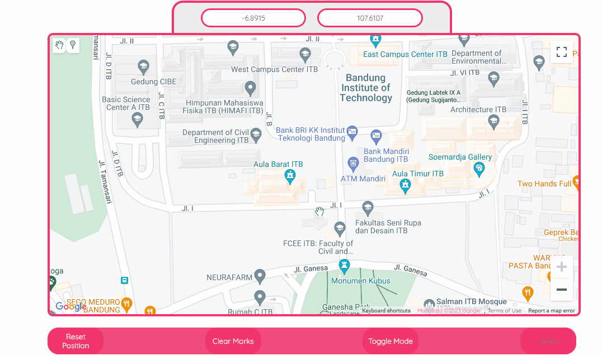
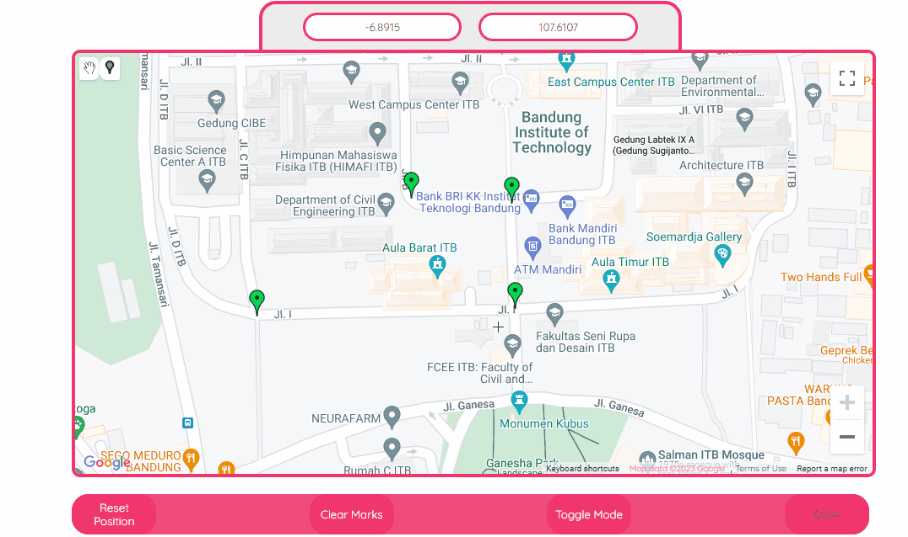
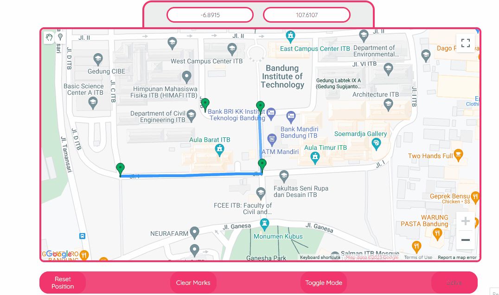

# Akasha Maps

<details>
  <summary>Table of Contents</summary>
  <ol>
    <li>
      <a href="#description">Description</a>
    </li>
    <li>
      <a href="#getting-started">Getting Started</a>
      <ul>
        <li><a href="#prerequisites">Prerequisites</a></li>
        <li><a href="#installation">Installation</a></li>
      </ul>
    </li>
    <li><a href="#usage">Usage</a></li>
    <li><a href="#author">Author</a></li>
  </ol>
</details>

## Description
Akasha Maps adalah aplikasi web pencarian rute terpendek. Pencarian rute dapat dilakukan dengan Uniform Cost Search (UCS) atau A*.

## Getting Started
### Prerequisites
- Install Node JS \
Kunjungi https://nodejs.org/en untuk install Nodejs
- Install create-react-app \
Untuk install create-react-app secara global, jalankan
    ```
    npm install -g create-react-app
    ```
- Browser dengan support Javascript
    - Disarankan menggunakan Google Chrome atau Microsoft Edge versi terbaru
    - Selengkapnya: https://caniuse.com/?search=javascript
- Generate Google Maps API KEY (opsional)

### Installation
- Clone repository `git clone https://github.com/Enliven26/Tucil3_13521137_13521148`
- Pindah ke folder src `cd ./Tucil3_13521137_13521148/src`
- Buat file .env pada folder saat ini yang berisi 
    ```
    REACT_APP_GMAP_API=$YOUR_KEY
    ```
    Ganti `$YOUR_KEY` dengan Google Map API key anda.
- Install npm packages
    ```
    npm install
    ```
- Jalankan aplikasi
    ```
    npm start
    ```

## Usage
Terdapat dua cara menggunakan aplikasi ini:
1. File Input \
Contoh dapat dilihat [di folder ini](test/test5). 
2. Google Maps API \
Fitur: 
    1. Menambah simpul (node)
    
    2. Menambah sisi (edge) \
    Peta merupakan graf berarah sehingga jalan dua arah harus dibuat seperti cuplikan di bawah
    
    3. Menghapus sisi
    
    4. Menghapus simpul \
    Sama seperti menghapus sisi, tetapi simpul yang sama dipilih dua kali
    5. Mencari jarak terpendek
     

## Author
- Michael Utama (13521137)
- Johanes Lee (13521148)

